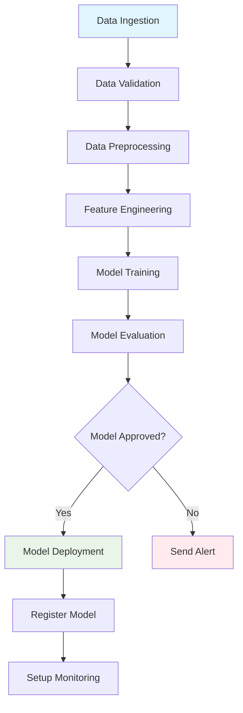

# ML Pipeline with Temporal Python SDK

Machine learning pipeline orchestrated using Temporal Python SDK that handles the complete ML workflow from data ingestion to model deployment with fault tolerance, monitoring, and experiment tracking.

## 🎯 Overview

This project demonstrates a comprehensive ML pipeline that includes:

- **Data Ingestion** with quality validation
- **Data Preprocessing** with feature engineering
- **Model Training** with hyperparameter tuning
- **Model Evaluation** with approval gates
- **Model Deployment** with versioning
- **Experiment Tracking** with MLflow integration
- **Fault Tolerance** with automatic retries
- **Monitoring** with notifications and logging

## 🏗️ Architecture



## 🚀 Features

### Core ML Pipeline
- **Multi-model training** with automated selection
- **Hyperparameter optimization** using GridSearchCV
- **Cross-validation** for robust model evaluation
- **Feature selection** and engineering
- **Data quality checks** and validation

### Orchestration & Reliability
- **Temporal workflows** for fault-tolerant execution
- **Automatic retries** with exponential backoff
- **Activity isolation** for better error handling

### Monitoring & Tracking
- **MLflow integration** for experiment tracking
- **Model registry** for version management
- **Real-time notifications** for pipeline status
- **Comprehensive logging** throughout execution


## 📋 Prerequisites

* Python >= 3.8
* [Poetry](https://python-poetry.org)
* [Local Temporal server running](https://docs.temporal.io/cli/server#start-dev) or [Temporal Cloud](https://cloud.temporal.io/)
* Set Environment Variables
```
TEMPORAL_HOST_URL=helloworld.sdvdw.tmprl.cloud:7233
TEMPORAL_MTLS_TLS_KEY=/Users/dummy/certs/ca.key
TEMPORAL_MTLS_TLS_CERT=/Users/dummy/certs/ca.pem
TEMPORAL_TASK_QUEUE=ML-pipeline
TEMPORAL_NAMESPACE=<temporal namespace>
```

## 🛠️ Installation

To install Poetry run:
    $ poetry install

With this repository cloned, run the following at the root of the directory:

    $ poetry update
    $ cd ui; poetry update

That loads all required dependencies. 


## 🚀 Quick Start

### 1. Start Temporal Server (if using local Temporal Cluster)

```bash
temporal server start-dev
```

This starts Temporal server on `localhost:7233` and UI on `http://localhost:8233`.

### 2. Start the Worker

In a new terminal window:

```bash
poetry run python worker.py
```

### 3. Run the Pipeline

In another terminal window:

```bash
poetry run python client.py
```

## 📁 Project Structure

```
Temporal-ML-Pipeline-main/
├── README.md
├── activities.py                    #ML pipeline task code using Temporal Python SDK
├── MLPipelineWorkflow.py           # Main pipeline workflow using Temporal Python SDK
├── client.py                       # Pipeline execution script
├── demodata/data/
│   ├── churn.csv                   # Sample dataset
│   ├── raw_data_*.pkl              # Raw ingested data
│   └── processed_data_*.pkl        # Preprocessed data
├── demodata/models/
│   └── best_model_*.pkl            # Trained models
├── demodata/artifacts/
│   ├── scaler_*.pkl               # Feature scalers
│   └── encoders_*.pkl             # Categorical encoders
└── mlruns/                        # MLflow experiment tracking
```

## ⚙️ Configuration

The pipeline is configured through the `PipelineConfig` dataclass:

```python
config = PipelineConfig(
    data_source="data/churn.csv",
    target_column="target",
    test_size=0.2,                    # Test set proportion
    validation_size=0.2,              # Validation set proportion
    max_features=15,                  # Maximum features to select
    cv_folds=5,                      # Cross-validation folds
    scoring_metric="accuracy",        # Evaluation metric
    model_registry_name="my_model",   # MLflow model name
    experiment_name="my_experiment"   # MLflow experiment name
)
```

## 🔧 Customization

### Adding New Models

Edit the `models` dictionary in `train_model` activity:

```python
models = {
    'RandomForest': {
        'model': RandomForestClassifier(random_state=42),
        'params': {
            'n_estimators': [100, 200],
            'max_depth': [10, 20, None]
        }
    },
    'XGBoost': {
        'model': XGBClassifier(random_state=42),
        'params': {
            'n_estimators': [100, 200],
            'learning_rate': [0.01, 0.1]
        }
    }
}
```

### Custom Data Sources

Modify the `ingest_data` activity to support your data source:

```python
@activity.defn
async def ingest_data(config: PipelineConfig) -> DataIngestionResult:
    if config.data_source.startswith('s3://'):
        # Add S3 data loading logic
        df = load_from_s3(config.data_source)
    elif config.data_source.startswith('postgresql://'):
        # Add PostgreSQL loading logic
        df = load_from_postgres(config.data_source)
    # ... existing logic
```

### Feature Engineering

Extend the preprocessing activity with domain-specific features:

```python
# Add in preprocess_data activity
if 'date_column' in df.columns:
    df['day_of_week'] = pd.to_datetime(df['date_column']).dt.dayofweek
    df['month'] = pd.to_datetime(df['date_column']).dt.month
    df['is_weekend'] = df['day_of_week'].isin([5, 6]).astype(int)
```

## 📊 Monitoring & Observability

### Temporal UI
- **Workflow execution**: `http://localhost:8233` or `https://cloud.temporal.io`
- **Activity status**: View individual activity results
- **Error handling**: See retry attempts and failures
- **Workflow history**: Complete execution timeline

### MLflow UI
```bash
mlflow ui
```
- **Experiment tracking**: `http://localhost:5000`
- **Model comparison**: Compare different runs
- **Model registry**: Version management
- **Artifact storage**: Model and metric storage

### Logs
All activities generate structured logs with timestamps and context:

```
2024-05-29 14:30:22 INFO Starting data ingestion from data/sample.csv
2024-05-29 14:30:23 INFO Data ingestion completed: 1000 rows, quality score: 0.95
2024-05-29 14:30:24 INFO Starting data preprocessing
```

## 🧪 Sample Dataset

The included sample dataset contains customer churn data with:

- **Features**: Age, income, credit score, account balance, geography, etc.
- **Target**: Binary churn indicator (0 = retained, 1 = churned)
- **Size**: 100 rows (for demo purposes)
- **Use Case**: Customer retention prediction

### Data Schema
```python
{
    'customer_id': 'int64',
    'age': 'int64',
    'income': 'int64',
    'credit_score': 'int64',
    'account_balance': 'float64',
    'num_products': 'int64',
    'has_credit_card': 'int64',
    'is_active_member': 'int64',
    'estimated_salary': 'float64',
    'geography': 'object',
    'gender': 'object',
    'target': 'int64'
}
```

## 🚦 Pipeline Execution Flow

1. **Data Ingestion**
   - Load data from configured source
   - Perform data quality checks
   - Calculate quality score

2. **Data Preprocessing**
   - Handle missing values
   - Remove duplicates
   - Feature engineering
   - Categorical encoding
   - Feature scaling
   - Feature selection

3. **Model Training**
   - Train multiple models
   - Hyperparameter tuning
   - Cross-validation
   - Select best model

4. **Model Evaluation**
   - Test set evaluation
   - Generate metrics
   - Apply approval criteria

5. **Model Deployment** (if approved)
   - Register model in MLflow
   - Create deployment artifacts
   - Setup monitoring


### Debug Mode

Enable debug logging:
```python
import logging
logging.basicConfig(level=logging.DEBUG)
```

## 🤝 Contributing

1. Fork the repository
2. Create a feature branch (`git checkout -b feature/amazing-feature`)
3. Make your changes
4. Add tests if applicable
5. Commit your changes (`git commit -m 'Add amazing feature'`)
6. Push to the branch (`git push origin feature/amazing-feature`)
7. Open a Pull Request

## 📄 License

This project is licensed under the MIT License - see the [LICENSE](LICENSE) file for details.

## 🙏 Acknowledgments

- [Temporal](https://temporal.io/) for the workflow orchestration framework
- [MLflow](https://mlflow.org/) for experiment tracking
- [Scikit-learn](https://scikit-learn.org/) for machine learning algorithms
- The open-source community for inspiration and tools

## 📞 Support

- **Issues**: [GitHub Issues](../../issues)
- **Discussions**: [GitHub Discussions](../../discussions)
- **Documentation**: [Temporal Python SDK Docs](https://docs.temporal.io/python)

---

**Happy ML Pipeline Building! 🚀**
